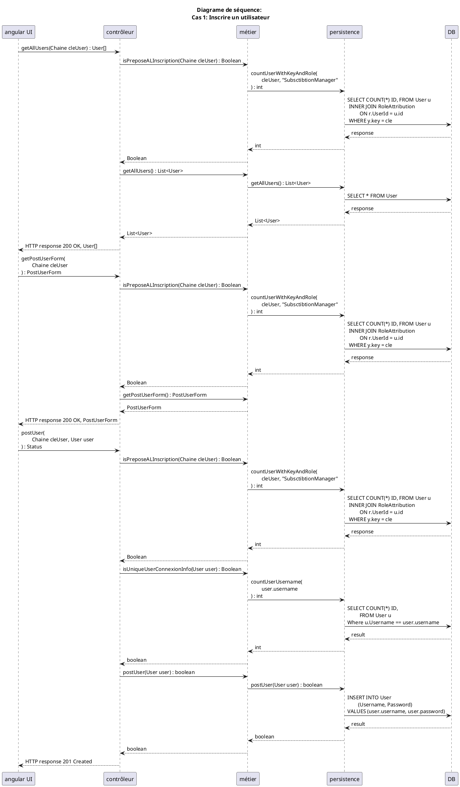

```plantuml
@startuml
title Diagrame de séquence: \n Cas 1: Inscrire un utilisateur

participant "angular UI" as A
participant "contrôleur" as C
participant "métier" as M
participant "persistence" as P
participant DB
A  ->  C    : getAllUsers(Chaine cleUser) : User[]
C  ->  M    : isPreposeALInscription(Chaine cleUser) : Boolean
M  ->  P    : countUserWithKeyAndRole(\n\tcleUser, "SubsctibtionManager"\n) : int
P  ->  DB   : SELECT COUNT(*) ID, FROM User u \n INNER JOIN RoleAttribution \n\t ON r.UserId = u.id \n WHERE y.key = cle
DB --> P    : response
P  --> M    : int
M  --> C    : Boolean
C  ->  M    : getAllUsers() : List<User>
M  ->  P    : getAllUsers() : List<User>
P  ->  DB   : SELECT * FROM User
DB --> P    : response
P  --> M    : List<User>
M  --> C    : List<User>
C  --> A    : HTTP response 200 OK, User[]
A  ->  C    : getPostUserForm(\n\tChaine cleUser\n) : PostUserForm
C  ->  M    : isPreposeALInscription(Chaine cleUser) : Boolean
M  ->  P    : countUserWithKeyAndRole(\n\tcleUser, "SubsctibtionManager"\n) : int
P  ->  DB   : SELECT COUNT(*) ID, FROM User u \n INNER JOIN RoleAttribution \n\t ON r.UserId = u.id \n WHERE y.key = cle
DB --> P    : response
P  --> M    : int
M  --> C    : Boolean
C  ->  M    : getPostUserForm() : PostUserForm
M  --> C    : PostUserForm
C  --> A    : HTTP response 200 OK, PostUserForm
A  ->  C    : postUser(\n\tChaine cleUser, User user\n) : Status
C  ->  M    : isPreposeALInscription(Chaine cleUser) : Boolean
M  ->  P    : countUserWithKeyAndRole(\n\tcleUser, "SubsctibtionManager"\n) : int
P  ->  DB   : SELECT COUNT(*) ID, FROM User u \n INNER JOIN RoleAttribution \n\t ON r.UserId = u.id \n WHERE y.key = cle
DB --> P    : response
P  --> M    : int
M  --> C    : Boolean
C  ->  M    : isUniqueUserConnexionInfo(User user) : Boolean
M  ->  P    : countUserUsername(\n\tuser.username\n) : int
P  ->  DB   : SELECT COUNT(*) ID, \n\t FROM User u \nWhere u.Username == user.username
DB --> P    : result
P  --> M    : int
M  --> C    : boolean
C  ->  M    : postUser(User user) : boolean
M  ->  P    : postUser(User user) : boolean
P  ->  DB   : INSERT INTO User \n\t(Username, Password) \nVALUES (user.username, user.password)
DB --> P    : result
P  --> M    : boolean
M  --> C    : boolean
C  --> A    : HTTP response 201 Created
@enduml
```
